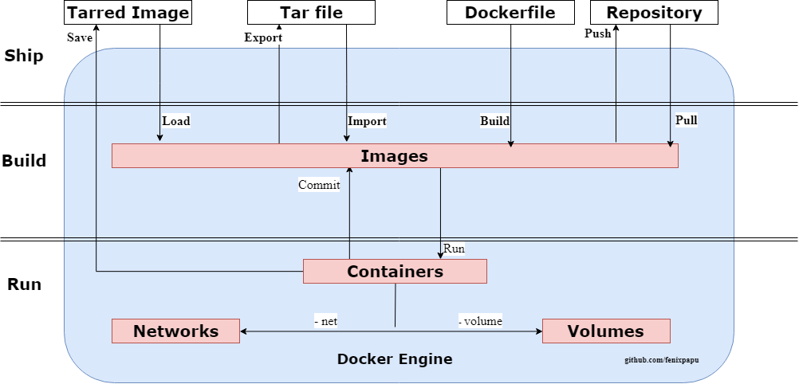

## Mở đầu
Hi guys!
Là một người mới tìm hiểu `docker` sau khi biết cách [build một nodejs app đơn giản](https://github.com/fenixpapu/blogs/blob/master/post/20190419-dockerizing-a-nodejs-web-app.md). Mình có lên trang web của docker để đọc [documentation](https://docs.docker.com/get-started/). Nhưng thấy khá dối vì có quá nhiều khái niệm: docker-something( docker-compose, docker-machine, docker engine, docker swarm, docker image, docker container...). Vì vậy mình quyết định không đọc tiếp documentation nữa. Mà sẽ tìm hiểu tổng quát qua các khái niệm của docker, để có cái nhìn bao quát trước khi đi vào chi tiết từng khái niệm. Đó cũng chính là nội dung của bài viết này sẽ trình bày.

## Docker Engine

- Là một lightweight runtime tool sẽ build và run các docker containers. Nó hoạt động như thế nào? Docker thực chất là một ứng dụng dạng client-sever. Docker Client sẽ nói chuyện với Docker Engine qua một RESTful API, để thực hiện việc build, ship và run các containers.

- Có bốn khái niệm chính trong thế giới Docker Engine - chúng đều có ID - bằng cách để cho chúng hoạt động cùng nhau, chúng ta có thể build, ship và run ứng dụng, ở bất kỳ đâu( Như website của Docker tóm tắt: [Docker — Build, Ship, and Run Any App, Anywhere.](https://www.docker.com/))
    - Images: image được sử dụng để đóng gói các ứng dụng và gói phụ thuộc. Image có thể được lưu local hoặc trên registry ( dịch vụ do các tổ chức cung cấp - ví dụ: https://hub.docker.com/).
    - Containers. Container chính là một thể hiện của images.( khi bạn chạy một ứng dụng)
    - Networks: Bạn có thể kết nối cũng như tách biệt các containers vào trọng một mạng riêng.
    - Volumes: Volumes được thiết kế để lưu dữ liệu, độc lập với vòng đời của containers - thế nghĩa là sao ? Thông thường chúng ta có thể lưu dữ liệu ngay trong containers kiểu thiết kế này làm containers bị phình to ra, và quan trọng hơn mỗi khi containers bị xóa, reset toàn bộ dữ liệu sẽ bị mất. Volumes sẽ giải quyết vấn đề này.
- Hình bên dưới mô tả các thức các Docker Client trên hoạt động và tương tác với nhau:
    
    - Loằng ngoằng khó hiểu vậy? Mình sẽ giải thích qua một chút. Docker thực hiện chính các việc: ship, build, run. Trong hình trên chia ra 3 phần tương ứng cho các việc này.
    - Nhìn từ trên xuống ví dụ cho phần ship: từ `Dockerfile` chúng ta có thể build ra 1 `image` hoặc từ một `repository` chúng ta có thể `pull` về `images` hoặc ngược lại từ các `image` này chúng ta có thể `push` lên `repository` đó chính là `ship`.
    - Phần thứ 2 từ `images` chúng ta có thể `run` thành một `container` hoặc `container` chúng ta có thể `commit` để tạo ra images. Đó là phần `build`.
    - Phần cuối: trong quá trình `contaiers` được chạy. Nó sẽ có thể liên kết với nhau( `networks`) và lưu trữ giữ liệu đâu đó ngoài `container` (`volumes`) đó phần run của docker.